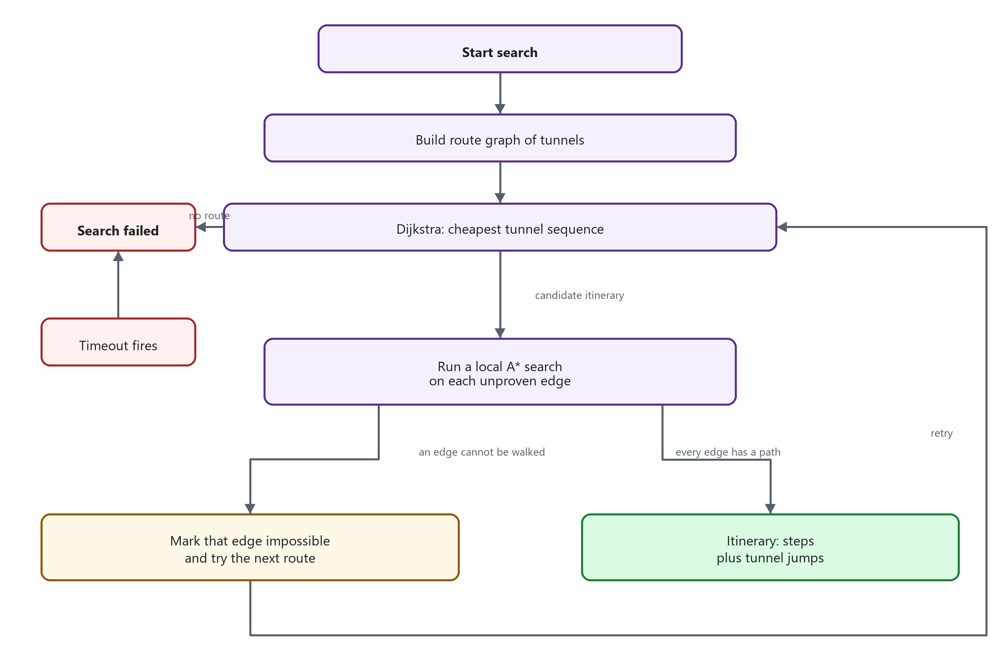

# How Journey finds a path

This describes pathfinding on the `QRF-WHIMC-update` branch (tip `a51418b`, v1.3.6). A player search is a destination search: from the player's block to a waypoint, player, or other cell. The same local search is also used for "go to this world" and "find the surface."

A search can fail even when a human could walk there. The usual causes are the time limit, the visited-block limit, missing portal links, and terrain the movement rules refuse to cross.

## Two searches, not one

Journey does not search the whole route as one grid.

1. **Route graph.** Worlds are connected by tunnels (nether portals, recorded cross-world teleports, and any tunnels a plugin registers). Dijkstra picks the cheapest sequence of tunnels from start to goal. Each edge is a walk *inside one world*: player to a portal, portal to portal, or portal to the destination.
2. **Local path.** Each edge is then searched block by block. That search is weighted A*. It only moves to neighboring blocks the enabled movement modes allow.

If the player and the destination are in the same world, the graph also has a direct edge that skips tunnels.

Walking between worlds is impossible. Only a tunnel can change domain. `SearchGraph.addPathTrial` drops any edge whose ends are in different worlds.



The loop lives in `GraphGoalSearchSession.runSearchUnit`. The graph solver is `WeightedGraph.findMinimumPath`. The block search is `PathTrial.runSafe`.

## Route graph

At the start of a destination search (`GraphGoalSearchSession.initSearch`):

- Collect every tunnel the player is allowed to use.
- Group them by the world they leave and the world they arrive in.
- Add an edge from the player to every tunnel that leaves the player's world.
- Add an edge from every arrival in a world to every departure in that same world.
- If the destination is in the same world, add a direct player-to-destination edge.
- Add an edge from every tunnel that arrives in the destination world to the destination.

Each edge is a `DestinationPathTrial`. Before it is actually searched, its length is an estimate (`PlanarOrientedDistanceFunction`): horizontal distance, plus extra cost when the height difference has to be climbed on a slope rather than walked flat. Tunnel nodes add their own cost. A nether or recorded teleport costs 8.

Dijkstra uses those estimates to choose which route to try first. The first pass prefers edges that already have a cached path (`CachingStatus.ALWAYS_USE`). If that finds nothing, it allows uncached edges. If a candidate route's local searches fail without changing the graph, it turns the cache off and tries again (`NEVER_USE`). A failed local search removes that edge from consideration, so the next Dijkstra run picks a different route.

When no sequence of edges reaches the destination, the search stops as failed. That is the "there is no route" result, before any timeout.

## Local block search

`PathTrial` is weighted A* on the block grid:

- The open set is a priority queue. A node's priority is distance walked so far plus `1.7` times the straight-line distance to the goal (`WeightedDistanceCostFunction`, `COST_FUNCTION_WEIGHT = 1.7`).
- The weight is above 1, so the search prefers nodes that look closer to the goal and can return a longer path than a pure shortest path.
- A node is done only when it is the exact destination cell. `SUFFICIENT_COMPLETION_DISTANCE_SQUARED` is 0. Standing next to the target is not success. The destination must be a cell a mode can step onto (the feet block), not the floor under it.
- Each expansion asks every enabled mode for the blocks it can reach from here, usually the surrounding 3×3×3. The step cost is Euclidean distance to that neighbor.
- The search yields every 1000 newly visited cells (`CELLS_PER_EXECUTION_CYCLE`) so other work can run.
- Up to 16 local searches run at once (`search.max-searches`). Extra ones wait or steal a slot from a search that already has several running. Waiting does not fail the search by itself, but it burns the timeout.

Successful paths are written to the path cache when the ends are persistent (waypoints, portals). The next search can reuse them if `Path.test` still finds each step reachable. A cached path that the world no longer allows is thrown out and searched again.

## Movement modes

Modes are built in `SearchSession.initialize` from what the player can do.

| Mode | When it is used | What it allows |
| --- | --- | --- |
| Walk | Always | Step to the 8 neighbors. Needs a passable body (2 blocks) and a block to stand on. Can drop up to 3 blocks. |
| Jump | Always | One block up, if there is a floor and headroom, including a diagonal step up. |
| Climb | Always | Onto an adjacent ladder or vine, and one block up while already on a climbable. |
| Swim | Always | Through water in the surrounding 3×3×3, if the body fits. |
| Door | Always | Through doors. Iron doors are ignored only when the door flag is on (default on). Otherwise Journey tries to see if the player can open the door. |
| Fly | Player can fly, and the fly flag is on (default on) | Any passable neighbor in the 3×3×3, including up and down. |
| Boat | Player has a boat | Boat movement on water. |
| Dig | Dig flag is on (default **off**) | Break through nearby solid blocks. |
| Tunnel | Always, as graph edges | Instant jump from a tunnel entrance to its exit. Not a block-by-block move. |

Fly and dig are the flags that add or remove a mode. The door flag changes how iron doors are read, not whether `DoorMode` exists.

## Tunnels and other worlds

`NetherManager` stores portal links and reloads them from the database on startup. A link is recorded when:

- a player or entity uses a nether or end portal (`PlayerPortalEvent`, `EntityPortalEvent`), or
- a player teleports across worlds by some other means (`PlayerTeleportEvent`), including Multiverse and custom portal plugins.

Until someone has taken that teleport, Journey has no tunnel, and a cross-world search has nothing to connect the worlds. A portal whose return trip was never recorded can still be used in the outbound direction. The origin world is connected to every tunnel that leaves it, even if nothing arrives there.

Plugins can register more tunnels through `JourneyApi.registerTunnels`. The player must have every permission the tunnel declares.

## Why a search fails

A failed search is `ResultState.STOPPED_FAILED`. The player sees the search-failed message. The server log has a line like:

```text
[Destination Graph Goal Search] {session: ...} failed after 30012ms
```

That line is `SearchManager` after the session stops. It does not say which limit was hit. The reason is in the debug lines from the path trial, if debug logging is on.

Canceled searches (`STOPPED_CANCELED`) are a different message. They happen when the player cancels, or when they start another search while one is running. Errors (`STOPPED_ERROR`) are invalid flags or an exception inside a path trial.

### Timeout

Default is 30 seconds (`search.flag.default-timeout`, flag `-timeout`). Range is 0 to 86400 seconds. `0` disables the timer.

When the timer fires, the session calls `stop(false)`. That is recorded as a **failure**, not a cancel. The "failed after" time will be about `timeout × 1000` milliseconds, plus scheduling delay.

Long routes, many portal combinations, fly mode (a much larger neighborhood), animation (`-animate`, which delays every expansion), and a server already at `search.max-searches` all make the timeout more likely. Chunk loads also stall the search: each missing chunk waits on the main thread (`ChunkCacheBlockProvider` calls `future.get()`).

### Visited-block limit (distance and dead ends)

Each local search may visit at most `search.max-path-block-count` cells. Default is 100000. Range is 1000 to 10000000.

Debug line: `reached max cell count, failing`.

That edge is then treated as impossible. If every reasonable edge dies this way, the whole search fails.

This is the limit people hit when the destination is far away. The counter is cells **explored**, not blocks in the finished path. A maze, a cave, an ocean, or a fly search fans out in three dimensions and can spend 100000 cells long before the straight-line distance is 100000. A sealed base with no legal entrance does the same thing: the search fills the reachable space until the cap, then fails.

The config comment warns against raising this just because searches fail. The destination may be unreachable under the movement rules. Raising it increases memory.

### No legal route

Debug line: `exhausted all options, failing`, or the graph returns no itinerary at all (`itineraryTrial == null`).

Typical cases:

- The destination cell is inside a solid block, or there is no 2-block-tall space to stand in.
- The only way up is more than one block, and there is no ladder, stair, or water. Jump is one block. Walk can fall three, not climb three.
- A wall, fence, or closed passage blocks every neighbor. Dig is off unless `-dig` is set.
- The player cannot fly, so air is not a path. Fly also requires the fly flag.
- Water is only traversable by swim (or boat, if the player has one).
- The worlds are different and no tunnel has been recorded. Someone has to use the portal or cross-world teleport once so Journey can store the link.
- The player lacks the tunnel's permission.
- An ungenerated chunk sits on the route. With `search.chunk-gen.allow` false (the default), those chunks are solid barriers (`UnavailableJourneyBlock` fails every passability check).
- The chunk cache is shut down, or the world returns a null chunk. Those blocks are solid too.

Blocks outside Y `-64` (inclusive) to `256` (exclusive) are treated as air, not as a failure by themselves.

### Cache and repeated attempts

The first graph pass only uses cached paths. A miss there is not a user-visible failure; the session retries without requiring the cache, then with the cache disabled.

A cached path is rechecked against the current world. If blocks changed, that edge is searched again. If the path cache is full (`storage.cache.max-cells`, default 500000), new successes are not stored. Searches still run. One warning is logged: the database has cached the max number of cells.

### Not a pathfinding failure

- **Another search started.** The running search is canceled.
- **Invalid flag.** The session stops as an error before the algorithm runs.
- **Exception in a mode or chunk lookup.** Logged as an error result, with a stack trace.
- **"Go to this world" while already in that world.** `DomainGoalSearchSession` stops as an error immediately.

## What to check when a route fails

1. Read the "failed after" time. Near 30 seconds means the timeout. Much less usually means the graph gave up or a path trial hit the cell cap or ran out of moves.
2. Turn on debug and look for `reached max cell count` versus `exhausted all options`.
3. Same world or not. If not, confirm a portal or teleport link exists (someone has used it since the link was stored). Nether links are reloaded from the database at startup.
4. Compare distance and terrain with `max-path-block-count`. A long or branching route can hit 100000 visited cells while the real walk is shorter.
5. Check flags: dig defaults off, fly only applies if the player can fly, timeout can be raised per search with `-timeout`.
6. Check whether the route crosses ungenerated chunks. Those are walls unless `search.chunk-gen.allow` is true.

## Settings that change failure

| Setting | Default | Effect |
| --- | --- | --- |
| `search.flag.default-timeout` | 30 seconds | Stop and fail when this elapses. `0` means no limit. |
| `search.max-path-block-count` | 100000 | Fail a local search after this many visited cells. |
| `search.chunk-gen.allow` | false | Ungenerated chunks are barriers. |
| `search.max-searches` | 16 | How many local searches run at once. Extra work waits, which can cause timeouts. |
| `search.flag.default-fly` | true | Allow fly when the player can fly. |
| `search.flag.default-dig` | false | Allow breaking blocks. |
| `search.flag.default-door` | true | Treat iron doors as passable. |
| `storage.cache.max-cells` | 500000 | Stop caching new paths. Does not fail the search. |

Per-search flags override the defaults: `-timeout`, `-fly`, `-dig`, `-door`, `-animate`.
